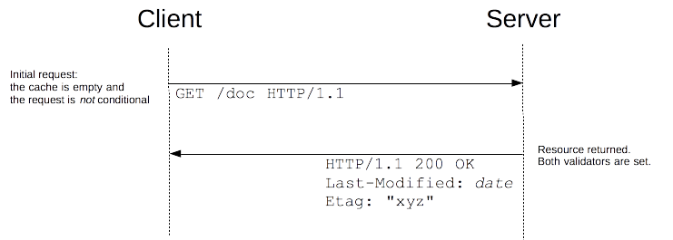
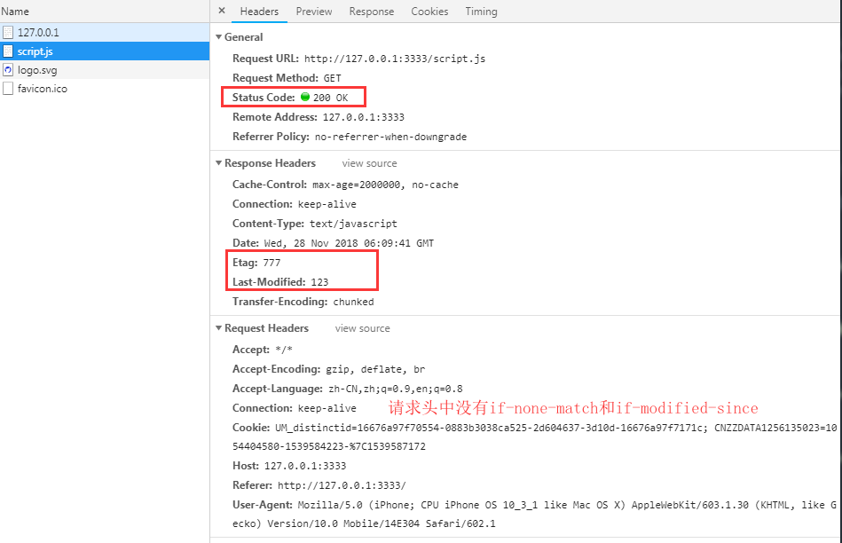
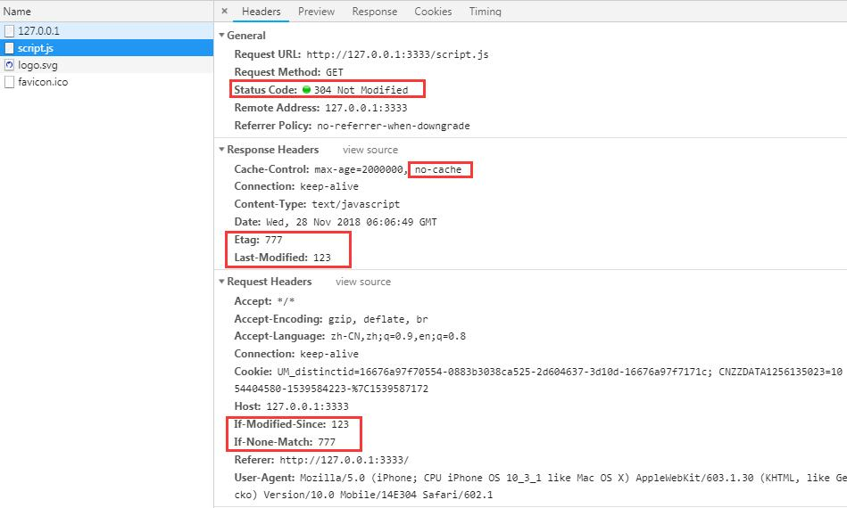

# 缓存

顾名思义，请求的资源在第一次拿到后（缓存到内存或硬盘中），如果没有变化或一段时间内，我们可以从硬盘或内存中获取，不用再次发起 HTTP 请求（节约资源，加载资源减少页面展示速度会快）

`Cache-Control`可以控制缓存的行为。

## 浏览器端常见的

### public
允许客户端，代理服务器，转发服务器等等使用缓存。

### priviate
只允许发起请求的客户端使用缓存，中间的代理服务器，cdn等不允许他们对资源进行缓存。

### max-age
值是秒数。缓存的最长有效期。浏览器如果发现某个资源的`Cache-Control`配置了该值（无`no-cache`，`no-store`的情况），就会在`max-age`限定的时间（秒）内使用缓存资源，即便资源发生改变，但URL不变，也不会从服务器请求更改的资源，能极大的节省带宽，提升性能。

但是弊端就会出现资源更新后，用户在缓存有效期内也无法查看最新的资源。所以通常的一个解决办法就是通过增加资源的`hash`值，改变URL使得浏览器重新加载资源。例如目前的打包工具基本都会在资源路径尾部加上一串`hash`。

### no-cache
如果某个资源的`Cache-Control`有设置`no-cache`，即是有条件的请求资源。客户端在使用缓存资源之前，每次都需要先向服务器发起请求确认是否可以使用缓存（即便设置了`max-age`）。通常会配合`Etag`，`Last-Modified`使用。

>注意：配置了no-cache，也是会向服务器请求的，即便是304返回缓存资源。依旧会消耗资源，但相比完整请求一个新的资源将其全部拉取，这部分消耗是很小很划算的。

### Etag
资源的一个令牌，服务端可以设置为资源的`hash`。首次请求资源时并不是条件请求，正常请求，服务端如果设置了`Etag`，便会跟资源绑定在一起返回给客户端，等到客户端再次访问该资源时，浏览器会在请求头上带一个`If-None-Match`，该请求头的值，即是跟资源绑定在一起的`Etag`值。两端的`Etag`比较，如果未变，则服务端应该设置为`304`返回，让客户端使用缓存。如果变了，则服务端这边返回最新资源。

服务端设置的关键代码：
```js
  response.writeHead(200, {
    'Etag': 'sj1j313j'
  })
```

### Last-Modified
资源的最近一次修改时间。服务端可以将资源修改的最近时间返回给客户端，同理首次请求非条件请求，浏览器会将资源和该修改时间绑定，再次请求该资源，浏览器会在请求头上带一个`If-Modified-Since`，该请求头的值，即跟资源绑定在一起的`Last-Modified`值。两端比较，如果时间发生变化，则说明资源变动，需要服务端返回最新资源。否则也是返回`304`使用缓存资源。

服务端设置的关键代码：
```js
  response.writeHead(200, {
    'Last-Modified': '123'
  })
```

### no-store
这才应该被叫做不准缓存，不允许客户端，缓存服务器缓存资源。每次都必须发送 HTTP 请求获取完整的信息。无法利用缓存的好处，使用时考虑清楚。

## 浏览器端不常用
**max-stale**：值是秒数。如果上面 2 个已经过期了，但是这个没过期，还是允许使用旧的缓存，无需去源服务器获取新资源。该头只在发起方有用，而浏览器端通常不能设置请求头，所以对浏览器来说作用不大。

**must-revalidate**：不能直接使用缓存，必须向源服务器确认一下是否真的过期了。

**proxy-revalidate**：针对缓存服务器.

**no-transform** 告诉代理服务器，不要对资源进行转换。

**s-maxage**：值是秒数。只会在代理服务器中才会替代**max-age**。

# 使用缓存获取资源
_首次获取浏览器资源_



_再次获取该资源（无改变）_



_再次获取该资源（改变）_

